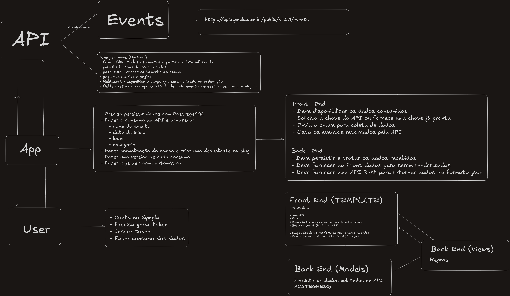

# Desafios encontrados

Para elaborar esse projeto, foram encontrados alguns desafios pelo caminho.

O primeiro desafio foi elaborar uma arquitetura compatível com o projeto. Dessa forma, optei por analisar a arquitetura ETL, onde são extraídas informações de um serviço, depois armazenadas e tratadas em um banco de dados, e finalmente disponibilizadas. Após estudar e pesquisar um pouco mais, foi possível elaborar uma forma de desenvolver o projeto que fosse compatível com esse padrão e como ele iria se comunicar.

O segundo desafio foi armazenar os dados sem conflitos entre eles. Para contornar isso, foi utilizada a função *atomic* da framework utilizada, para seguir os princípios ACID.

O terceiro desafio foi manter a regra do projeto com os dados oferecidos, pois era necessário evitar, por exemplo, duplicatas dentro do sistema. Tendo isso em vista, foram estabelecidas regras que armazenavam cada informação apenas uma vez sem repetir, porém, caso fosse alterada, poderia ser armazenada com uma carga diferente.

Disponibilizo também uma imagem do rascunho que utilizei para fazer meus estudos em cima do projeto, para que conseguisse elaborar a arquitetura utilizada, e o que a **API Sympla** disponibilizava.

