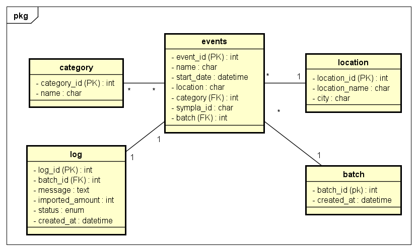

# Modelagem de Dados

Para modelar os dados, foi feito um DER (Diagrama de Entidade e Relacionamento), com base nos dados que seriam trabalhados. Isso auxiliou o desenvolvimento da aplicação a nível técnico, pois além de facilitar a criação dos models que seriam implementados, ajudou no mapeamento dos dados e seus respectivos tipos.

O modelo desenvolvido permite uma boa escalabilidade para a aplicação, aceitando futuros atributos e relacionamentos, tendo sido elaborado com entidades devidamente separadas.

**Modelo**: 

**batch**: Essa entidade é responsável por registrar a versão da entidade *Events* ao ser importada no sistema, registrando o horário.  

**location**: Essa entidade é responsável por armazenar os locais dos eventos, contendo o nome do local e a cidade.  

**category**: Considerando que a *API Sympla* possui mais de uma categoria, foi pensada uma relação de muitos para muitos. Embora não seja muito comum, é compatível com o **Django ORM** utilizando o campo *ManyToMany*.  

**log**: Responsável por coletar todas as informações necessárias para documentar os processos realizados no registro do evento. Dessa forma, a cada interação com a *API Sympla*, o Log registra a quantidade de eventos processados, a mensagem resultante (se houve sucesso ou erro), define seu status e armazena o horário de criação.  

**events**: Essa entidade é responsável por armazenar as informações principais dos eventos, mapeando: nome, data de início, localização, categoria, sympla_id e a carga.
