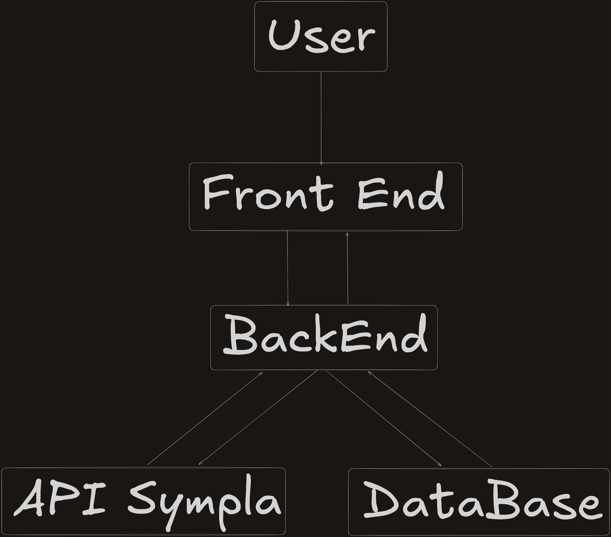

# Pipeline de dados

Para definição dessa pipeline foi feita uma análise de como trabalhar com a **API Sympla**, sendo necessário verificar como os dados eram retornados e como trabalhar com os mesmos. Para isso, foi consultada a documentação da própria *API*.

Com base nela, foi elaborada uma série de etapas para preparar os dados: como seriam recebidos, como seriam tratados, formatados e disponibilizados na aplicação. Foi elaborado o seguinte modelo:

Com essa arquitetura elaborada, foi possível desenvolver a aplicação mais facilmente. Pois ficou claro que o usuário, através do *Front End*, faz requisições ao servidor, onde o *Back End* as recebe e se comunica tanto com o banco de dados quanto com a **API Sympla** para solicitar seus serviços e armazená-los. Depois disso, os dados eram disponibilizados através de uma resposta no *Front End*.

Sabendo disso, foi possível estruturar uma pipeline de dados que fizesse o tratamento das variáveis recebidas e suas normalizações. Foram utilizadas as funções nativas e classes do *Python*, tanto para remover espaços, tratar cases e tipar os dados recebidos. Para entender melhor a aplicação, foi utilizado *type hints* para indicar o que seria recebido e o que seria retornado.